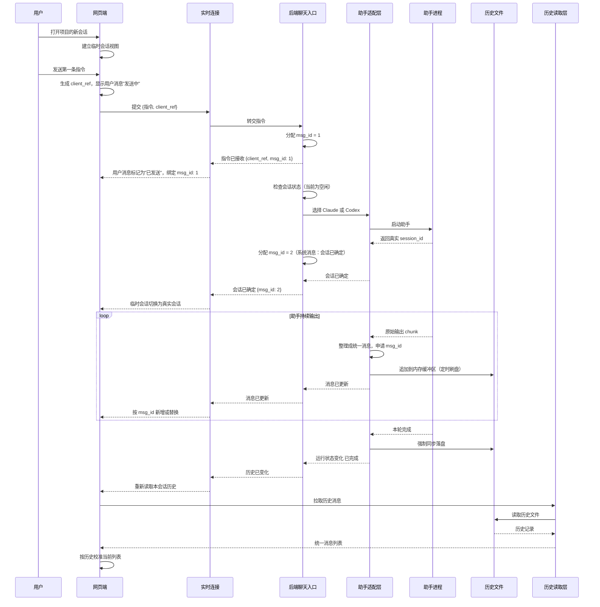
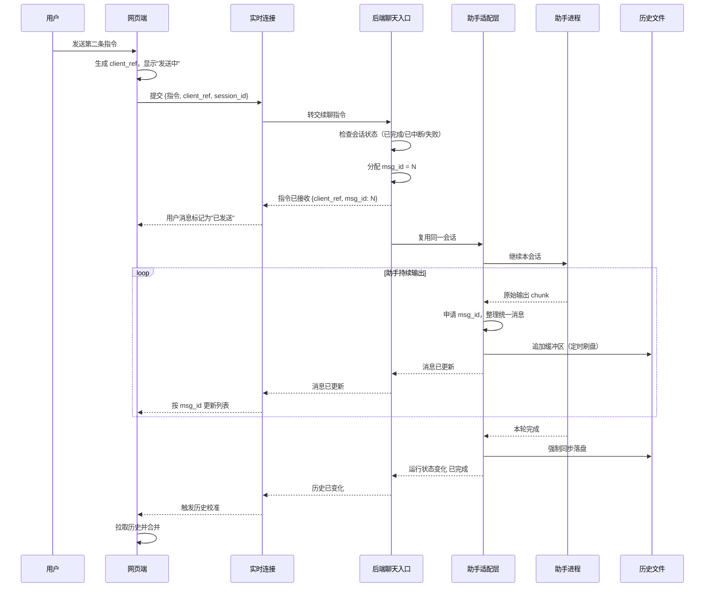
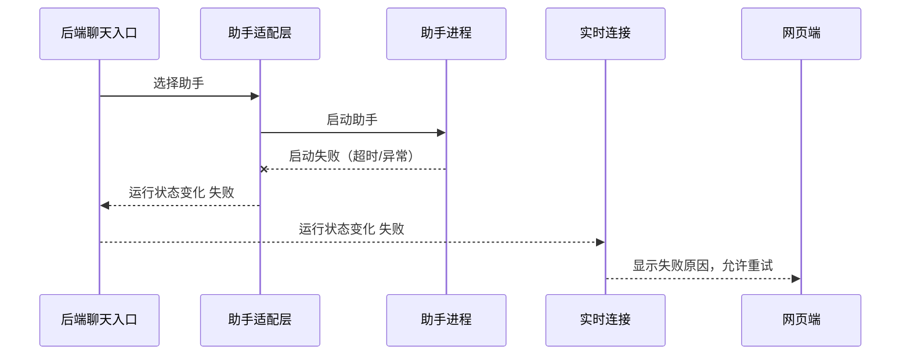
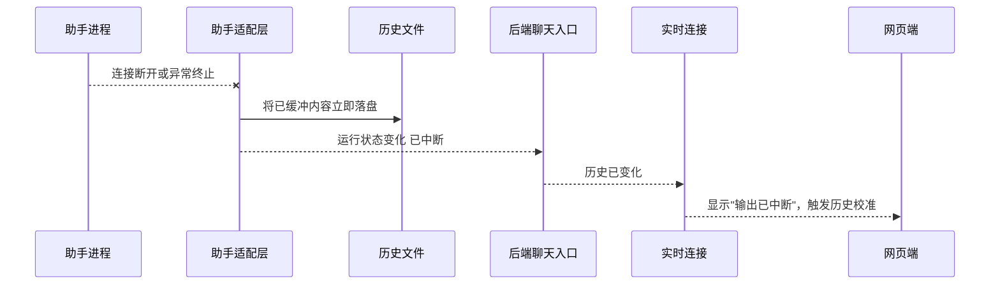
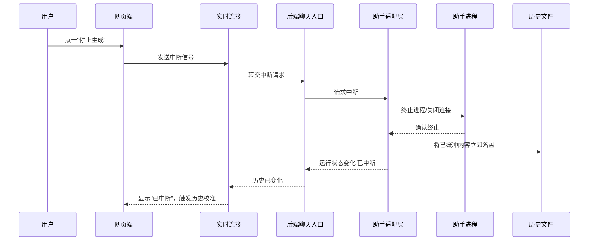
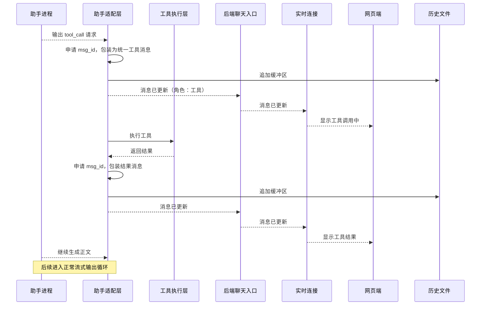
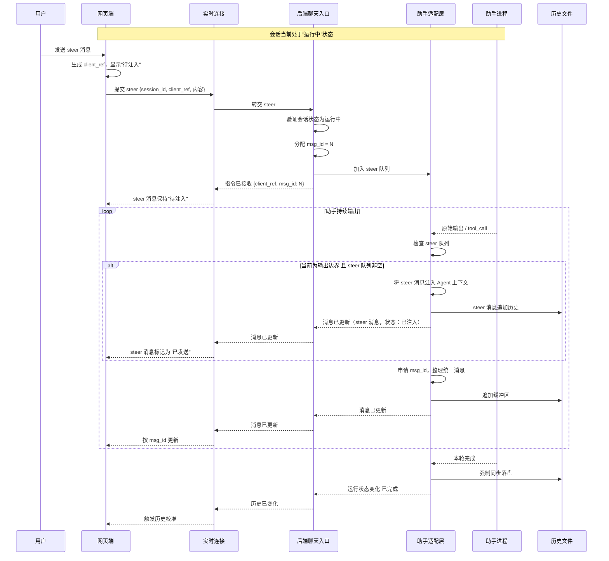
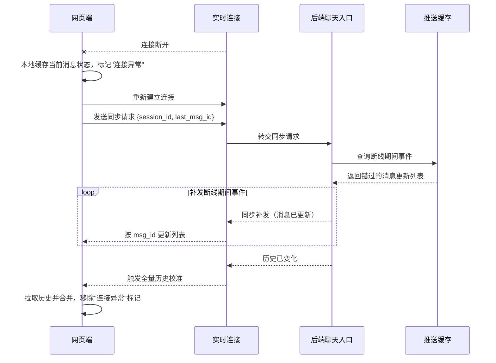

# 聊天消息转发链路设计

> 本文档定义 ccflow 多助手聊天系统的消息流转协议。
> 目标：统一 Claude、Codex 及后续助手在前端展示的消息格式，
> 确保实时推送、历史文件、页面刷新三者所见一致。

## 目标

把 Claude、Codex 以及后续其它助手接到同一条聊天链路上。网页端看到的消息、后端推送的消息、历史文件重新加载出来的消息必须一致。

设计目标：

- 前端只关心一种聊天消息格式，不再按助手分别拼消息。
- 后端负责把不同助手的输出整理成统一格式。
- 消息先有明确编号，再进入前端列表，避免覆盖、重复、误判失败。
- 历史文件是最终依据，实时推送只是让页面更快看到变化。
- 第一条指令和第二条指令走同一套状态，只是第一条多一步"创建真实会话编号"。
- 支持运行中 steer（不中断助手的情况下插入用户消息）。

## 核心概念

### 消息编号

所有消息使用**会话内自增正整数**，从 1 开始。编号由会话对象统一管理，Chat 和 Adapter 按需申请。

| 消息类型 | 编号分配者 |
|---------|----------|
| 用户消息 | Chat |
| 系统消息 | Chat |
| 助手消息 | Adapter |
| 工具消息 | Adapter |

前端提交用户消息时携带 `client_ref`（临时追踪标识，仅用于本次请求跟踪）。后端 `指令已接收` 事件返回正式 `msg_id`，前端将该消息绑定到编号。

编号一旦分配永不改变，同一编号的消息内容更新属于替换而非新增。

### 会话状态机

每个会话在任意时刻处于以下状态之一：

```
空闲 --(收到指令)--> 运行中
运行中 --(正常结束)--> 已完成
运行中 --(用户打断)--> 已中断
运行中 --(异常)--> 失败
运行中 --(收到 steer)--> 运行中  [状态不变，内容注入]
已完成 --(收到新指令)--> 运行中
已中断 --(收到新指令)--> 运行中
失败 --(收到新指令)--> 运行中
```

**约束：只有"空闲/已完成/已中断/失败"状态才能接收新指令。**
Steer 不改变状态，直接在当前运行中注入内容。同一会话不能同时处理多条普通指令，但可以接收 steer。

### 历史写入策略

Adapter 维护内存缓冲区：

- **流式写入**：输出过程中，缓冲区每 500ms 或每 4KB 刷盘一次。
- **完成确认**：本轮助手输出结束后，Adapter 强制同步落盘，再发送 `运行状态变化 已完成`。
- **异常落盘**：Agent 异常中断时，Adapter 将已缓冲内容立即落盘，再发送 `运行状态变化 失败/已中断`。
- **steer 落盘**：steer 消息注入后立即追加到历史，确保后续生成基于完整上下文。

历史文件的每条记录包含完整统一消息字段 + `校验和`，用于检测文件损坏。

## 新链路分工

- **网页端**：负责提交指令、显示消息、显示运行状态、管理本地消息缓存。
- **后端聊天入口（Chat）**：负责收指令、验证会话状态、分配消息编号、调用具体助手、生成系统消息。
- **助手适配层（Adapter）**：负责把 Claude、Codex 的原始输出转成统一消息事件，申请消息编号，管理历史缓冲区，处理 steer 注入。
- **历史读取层（Reader）**：负责从历史文件读出统一格式，屏蔽不同助手历史文件的物理结构差异。
- **消息推送层（Socket）**：只推送统一事件，不直接暴露各助手原始结构；负责断线期间的事件暂存与重连补发。

## 统一消息事件

所有助手都只向前端发这几类事件：

| 事件 | 触发时机 | 说明 |
|-----|---------|-----|
| `指令已接收` | Chat 收到用户指令并验证通过 | 携带 `client_ref` 和正式 `msg_id`，前端将用户消息标记为"已发送" |
| `会话已确定` | 第一条指令创建出真实会话编号，或续聊确认当前会话编号 | 前端将临时会话切换为真实会话 |
| `消息已更新` | 某条消息有新增内容或状态变化 | 流式过程中的增量推送，按 `msg_id` 新增或替换 |
| `运行状态变化` | 会话状态发生转移 | 运行中 / 已完成 / 已中断 / 失败 |
| `历史已变化` | 本轮助手输出完成且历史落盘确认 | 提示前端按会话编号重新读取历史消息进行校准 |
| `同步补发` | 断线重连后 | 推送断线期间错过的 `消息已更新` 事件 |

前端消息列表只接收统一后的消息字段：

- `消息编号`：会话内自增正整数
- `会话编号`
- `请求编号`：即 `client_ref`
- `角色`：用户、助手、工具、系统
- `正文`
- `工具信息`
- `发送状态`：发送中、已发送、失败、待注入（steer 专用）
- `时间`

**角色说明**：

- **用户**：用户提交的指令或 steer 消息。
- **助手**：AI 生成的回复内容。
- **工具**：工具调用请求或工具返回结果。
- **系统**：会话创建、助手切换、异常通知等系统级信息，用户可见但只读。

**发送状态说明**：

- **发送中**：前端已提交，等待后端确认。
- **已发送**：后端返回 `指令已接收`。
- **失败**：后端拒绝或传输异常。
- **待注入**：steer 消息已收到，等待在当前输出边界插入。

## 正常流程

### 第一条指令



### 第二条及后续指令



## 异常流程

### Agent 启动失败



### 流式输出中断



### 用户主动中断



## 工具调用流程



## Steer 流程（运行中干预）

Claude 和 Codex 支持在助手运行中插入用户消息，无需中断。 steer 消息在当前输出边界（tool call 结束或 chunk 边界）注入上下文，助手继续生成。



**steer 约束**：

- 同一会话可接收多条 steer，按 FIFO 顺序注入。
- steer 消息注入时机由 Adapter 根据当前输出类型决定：若正在进行 tool call，则在 tool call 结束后注入；若在纯文本输出，则在下一个输出边界注入。
- steer 不改变会话状态，会话保持"运行中"直至本轮自然结束或被打断。

## 断线重连流程



**推送缓存策略**：Socket 层维护每个会话最近 N 条（建议 100 条）`消息已更新` 事件。断线重连后，按客户端提供的 `last_msg_id` 补发后续事件。若 `last_msg_id` 不在缓存范围内，直接推送 `历史已变化` 让前端全量拉取。

## 历史校准策略

前端维护两套数据：

1. **实时消息列表**：由 `消息已更新` 事件驱动，反应最快。
2. **历史消息列表**：由 `历史已变化` 事件触发 Reader 拉取，是最终权威。

收到 `历史已变化` 后的校准逻辑：

```
1. 拉取历史消息列表 H
2. 遍历实时消息列表 R：
   a. 若 msg_id 存在于 H：用 H 中的版本替换 R 中的版本（历史为准）
   b. 若 msg_id 不存在于 H：保留在 R 中（可能是极新的消息，下次校准再处理）
3. 遍历 H：
   a. 若 msg_id 不存在于 R：将消息插入 R（历史中有但实时未推送到的消息）
4. 按时间戳排序 R
5. 更新页面显示
```

**冲突解决原则**：历史文件 > 实时推送。若同一 `msg_id` 的内容不同，以历史文件为准。

## 必要重构

1. **后端增加统一消息整理层。**
   Claude、Codex 原始输出不能直接推给前端。先转成统一消息，再推送。

2. **前端消息列表改成按消息编号合并。**
   新消息追加，已有消息替换。不能因为历史列表刷新就丢掉实时消息。

3. **用户消息由后端确认发送状态。**
   前端可以先显示"发送中"，但必须等后端的 `指令已接收` 或历史回放确认后改为"已发送"。不要只靠前端定时器猜测失败。

4. **所有助手完成后都触发同一种历史校准。**
   Claude 和 Codex 都在本轮完成后发 `历史已变化`，前端统一重新读取本会话历史。

5. **历史读取层输出统一格式。**
   前端不应该知道 Claude 历史文件和 Codex 历史文件结构差异。

6. **后端增加会话状态机控制。**
   同一会话必须串行处理普通指令，防止并发导致的编号冲突和历史乱序。 steer 除外。

7. **Socket 层增加推送缓存。**
   支持断线重连后的事件补发，或至少触发全量历史拉取。

8. **Adapter 增加历史缓冲区。**
   流式输出过程中不要每次 chunk 都同步写磁盘，采用定时刷盘 + 完成时强制落盘策略。

9. **每条历史记录增加校验和。**
   防止文件损坏导致的历史不一致，Reader 读取时验证并上报异常。

10. **Adapter 增加 steer 队列和注入机制。**
    支持在助手运行中接收并延迟注入用户消息，不改变会话状态。

## 判断标准

- 新建会话第一条消息：不打叉，不重复，刷新前后内容一致。
- 助手流式回复：实时可见，历史校准后位置和内容不变。
- 第二条消息：复用同一会话编号，消息顺序稳定。
- Claude、Codex 的前端处理代码没有两套拼消息逻辑。
- 刷新页面、断线重连、历史重新读取后，消息列表和实时状态一致。
- 工具调用过程和结果显示正确，不丢失工具返回内容。
- 用户中断或助手异常时，已生成的内容保留，状态显示准确。
- 同一会话内不会出现两条普通指令同时运行导致的消息编号冲突。
- 助手运行中可发送 steer 消息，steer 在当前输出边界注入，助手继续生成，不丢失已生成的内容。
